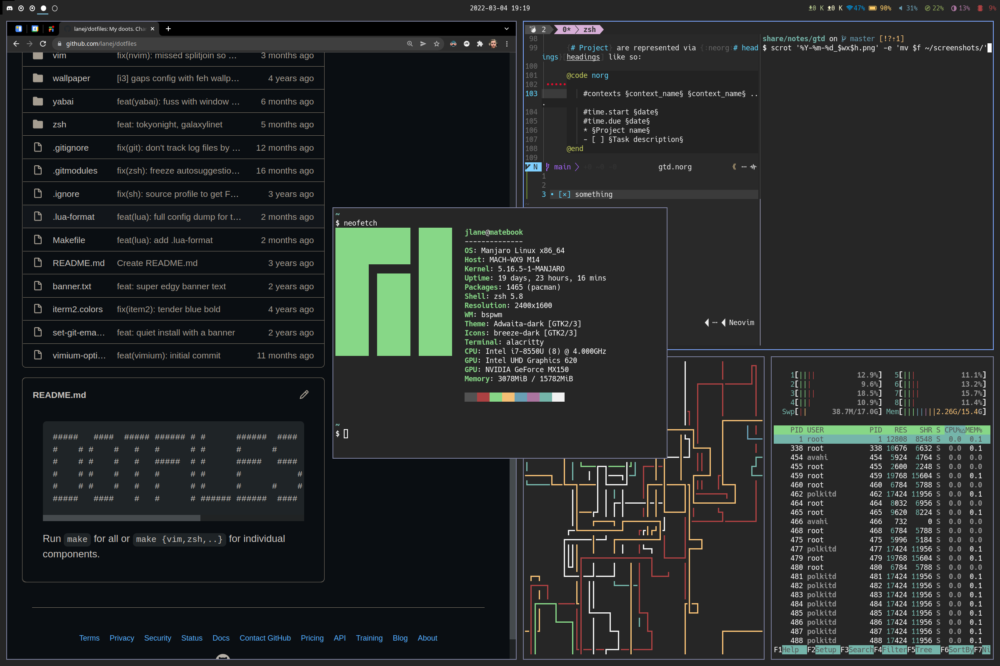

   ███████╗██╗██╗     ███████╗███████╗
   ██╔════╝██║██║     ██╔════╝██╔════╝
   █████╗  ██║██║     █████╗  ███████╗
   ██╔══╝  ██║██║     ██╔══╝  ╚════██║
██╗██║     ██║███████╗███████╗███████║
╚═╝╚═╝     ╚═╝╚══════╝╚══════╝╚══════╝

Run `make` for all or `make {vim,zsh,..}` for individual components.

### Stack

* alacritty
* tmux
* neovim
* fzf

### Linux

Manjaro + Centos

* bspwm
* polybar
* rofi

### Darwin

* yabai
* alfred
