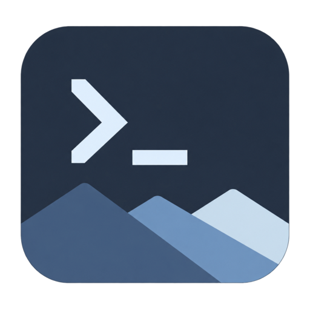

#  Dotfiles

Personal dotfiles managed via `make` + symlinks, cross-platform (macOS and Linux).

## Installation

```sh
$ git clone https://github.com/lanej/dotfiles.git ~/.files && cd ~/.files
$ make          # symlink configuration files
$ bash bootstrap.sh # install packages and tools
```

`make` (or `make claude`) also removes installed Claude Code plugins listed in
[`claude/blocked-plugins.json`](claude/blocked-plugins.json) from user scope when
the Claude CLI is available. Add a marketplace-qualified plugin ID to that list
to retire another plugin; Superpowers is the initial entry. Already-absent
installations are a no-op; invalid configuration, inspection, or uninstall
failures stop the task so they can be fixed.

`make codex` also exposes the shared `claude/skills` tree through
`~/.agents/skills/dotfiles`, preserving local Codex skills. Skill directories
remain linked to their sources. File-linked or lowercase entrypoints are
normalized in `~/.codex/dotfiles-skills`; rerun `make codex-skills` after changing
those entrypoints. Missing external skill sources are reported and skipped.

`make codex` converts the shared `claude/agents` Markdown files (including
external symlinks) into personal agents in `~/.codex/agents/*.toml`.
Names, descriptions, and instructions are preserved; Claude model aliases and
tool lists are omitted so agents inherit Codex's model and tools. Agents limited
to Read/Glob/Grep receive a read-only sandbox. Local Codex agents are preserved,
including name collisions. Rerun `make codex-agents` after changing agent
sources, then start a new Codex session. Missing external sources are reported
and skipped.

`make codex` shares Claude's user MCP servers and the MCP servers bundled with
enabled user-scope Claude plugins. Shared definitions come from
`.claude/mcp-servers.json`, merged into Claude's user configuration. Explicit
user definitions take precedence over plugin servers. Codex-only servers remain
installed, and unchanged definitions retain their Codex settings. The Claude
`codex` MCP server is excluded to avoid recursion. Bearer tokens stay in
environment variables, and plugin install paths are resolved without modifying
the plugin cache. Rerun `make codex` after changing server definitions or plugins,
then restart Codex to load the configuration. See Codex's
[MCP configuration documentation](https://learn.chatgpt.com/docs/extend/mcp?surface=cli).

`make codex` also installs the shared Claude/Codex tmux window-status hooks.
Run `make codex-tmux` for just this integration, then restart Codex and trust
the new handlers with `/hooks`. The shell's `codex` function uses `--no-daemon`
inside tmux so hooks inherit the launching pane. See
[tmux window status](docs/tmux.md#claude-and-codex-window-status) for the states
and event mapping.

## Shared shell history

Mac bootstrap installs `uv` and configures Atuin sharing with `dev` automatically.
Have current dotfiles installed in `~/.files` on the SSH host and authenticate
to any bastion first. Choose another host with
`ATUIN_SYNC_HOST=dev2 bash bootstrap.sh`.

To configure sharing again without reinstalling other tools:

```sh
make atuin-sync                         # configure sharing with dev
make atuin-sync ATUIN_SYNC_HOST=dev2     # use another SSH alias
```

The target installs matching Atuin clients and a Linux server, starts a private
SSH tunnel, and merges existing history. Reruns reuse the account and encryption
key. Original stores stay intact; recovery details are saved with owner-only
permissions at `~/.local/share/atuin/self-hosted-account.json` on both machines.
A replacement Mac can recover those details over SSH from the configured server.
Unlock your SSH agent and authenticate to any bastion before running the target.

## Stack

| Tool | Description |
|---|---|
| [zsh](https://www.zsh.org/) | Shell with autosuggestions and syntax highlighting |
| [starship](https://starship.rs/) | Cross-shell prompt |
| [neovim](https://neovim.io/) | Editor (Lua config) |
| [tmux](https://github.com/tmux/tmux) | Terminal multiplexer |
| [kitty](https://sw.kovidgoyal.net/kitty/) | GPU-accelerated terminal |
| [fzf](https://github.com/junegunn/fzf) | Fuzzy finder |
| [skim](https://github.com/skim-rs/skim) | Rust-native fuzzy finder |

See [docs/stack-darwin.md](docs/stack-darwin.md) and [docs/stack-linux.md](docs/stack-linux.md) for platform-specific tools. See [docs/tmux.md](docs/tmux.md) for session persistence and the `tmux-sessions` command.

In Kitty, `Alt+1` through `Alt+9` send `F1` through `F9`, `Alt+0` sends `F10`,
and `Alt+-` / `Alt+=` send `F11` / `F12`. On macOS, use Option for Alt.
These shortcuts also work through tmux, so Codex actions such as `F2` and `F4`
are available as `Alt+2` and `Alt+4`. Reload Kitty with `Cmd+Shift+R`.

## Key Makefile Targets

| Target | Description |
|---|---|
| `make` | Symlink all configuration files |
| `make claude` | Set up Claude skills, commands, agents, and MCP servers |
| `make codex` | Share dotfiles skills and Claude user and plugin MCP servers with Codex |
| `make codex-skills` | Refresh shared dotfiles skills for Codex |
| `make codex-agents` | Convert shared Claude agents for Codex |
| `make codex-tmux` | Install shared tmux window-status hooks for Codex |
| `make git` | Symlink git configuration |
| `make tmux` | Symlink tmux configuration |
| `make zsh` | Symlink zsh configuration |
| `make cargo` | Symlink Cargo/Rust configuration |

## Directory Layout

```
~/.files/
├── nvim/          # Neovim config (Lua)
├── zsh/           # Zsh config and plugins
├── git/           # Git config and global gitignore
├── kitty/         # Kitty terminal config
├── tmux/          # Tmux config
├── yabai/         # macOS tiling WM config
├── claude/        # Claude commands and agents (selectively versioned)
├── bin/           # Utility scripts (selectively versioned)
├── bootstrap/     # Bootstrap helpers
├── docs/          # Tool-specific notes and decision rationale
└── Makefile       # Symlink and setup targets
```

## Machine Migration

```sh
$ sh transfer.sh
```

---

See [docs/](docs/) for tool-specific notes and decision rationale.
For creating and updating pull requests, follow [the PR guidance](docs/pull-requests.md).
