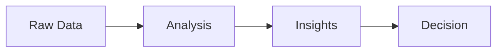
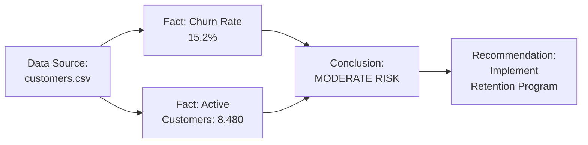

# Quarto Skill

Quarto is an open-source scientific and technical publishing system built on Pandoc. It renders computational documents (with Python, R, Julia code) to publication-quality output in multiple formats.

## Best Practices (TL;DR)

1. **Markdown-First**: Default to `format: gfm` (GitHub-flavored markdown) for composability, portability, and archival
2. **Dark Mode**: Always use `auto-dark` filter with dual themes for HTML output (accessibility and modern UX)
3. **Visual Expression**: Use charts and formatted tables, NEVER raw data dumps (`df.head()`, `print(dict)`)
4. **LaTeX for Math**: Use LaTeX notation for ALL mathematical expressions ($\alpha = 0.15$, not "alpha = 0.15")
5. **Professional Tables**: Use LaTeX tables (booktabs) for PDF, Great Tables for HTML
6. **No TOC**: Table of contents is usually noise - use clear section headings instead
7. **DOCX for Google**: Use `--to docx` for easy upload to Google Docs (better than PDF)
8. **Double Newlines**: Markdown requires blank lines between paragraphs (single newline = same paragraph)
9. **Render on Demand**: Generate PDF/HTML only when specifically needed for distribution, not by default

## Visual Expression Philosophy

**CRITICAL: Quarto documents are for COMMUNICATION, not raw data dumps.**

Quarto outputs are static documents meant to convey insights to humans. Raw dataframes, print statements, and JSON blobs fail to communicate effectively.

### Visual Hierarchy (Use in Order)

1. **Charts/Plots** - For trends, distributions, comparisons, relationships
2. **Formatted Tables** - For structured data with styling and context
3. **Formatted Metrics** - For key numbers with context and formatting
4. **Raw Output** - NEVER (not even for debugging - use separate analysis files)

### Anti-Patterns: What NOT to Do

```python
# ❌ BAD: Raw dataframe dump
df.head()

# ❌ BAD: Print statements
print(f"Total: {total}")
print(data_dict)

# ❌ BAD: Bare variable returning data structure
result  # Returns raw dict/JSON

# ❌ BAD: DataFrame info without formatting
df.describe()
df.info()
```

```markdown
❌ BAD: Plain text for mathematical notation
- The growth rate is alpha = 0.15 or 15%
- We calculated the mean mu = sum(xi)/n
- The correlation coefficient r = 0.85

❌ BAD: No table formatting
```python
print(df.head())
```

❌ BAD: Using asterisks for equations
- E = m * c^2
- y = beta0 + beta1 * x
```

### Good Patterns: Visual Communication

```python
# ✅ GOOD: Chart for trends
import matplotlib.pyplot as plt

fig, ax = plt.subplots(figsize=(10, 6))
df.groupby('date')['sales'].sum().plot(ax=ax, kind='line')
ax.set_title('Sales Trend Over Time')
ax.set_ylabel('Sales ($)')
plt.tight_layout()
plt.show()

# ✅ GOOD: Formatted table using Great Tables
from great_tables import GT

(GT(df.head(10))
    .tab_header(title="Top 10 Sales Records")
    .fmt_currency(columns="sales", currency="USD")
    .fmt_date(columns="date", date_style="medium"))

# ✅ GOOD: Formatted table using pandas markdown
print(df.head(10).to_markdown(index=False, tablefmt='grid'))

# ✅ GOOD: Formatted metrics in markdown with LaTeX
from IPython.display import Markdown

Markdown(f"""
## Key Metrics

- **Total Sales**: ${total_sales:,.2f}
- **Average Order**: ${avg_order:,.2f}
- **Growth Rate**: $\\alpha = {growth_rate:.1%}$ (15% YoY)
- **Top Product**: {top_product}

### Statistical Summary

The linear regression model $y = \\beta_0 + \\beta_1 x + \\epsilon$ yielded:

- Slope: $\\hat{{\\beta_1}} = 3.2$ (SE = 0.4)
- $R^2 = 0.78$, indicating strong fit
""")

# ✅ GOOD: Mermaid diagram for relationships
Markdown('''

''')
```

### Why Visual Expression Matters

- **Documents are for humans**: Show insights, not data structures
- **Static format**: No interactive exploration - must communicate clearly on first view
- **EPIST provenance**: Visualize fact→conclusion chains, not raw JSON
- **Professional output**: Charts and tables look polished in PDF/HTML/Word
- **Accessibility**: Visual hierarchy helps readers navigate content
- **Shareability**: Well-formatted outputs communicate without explanation

## Markdown Formatting Rules (CRITICAL)

**IMPORTANT: Markdown requires blank lines between paragraphs for proper rendering.**

### Line Breaks and Paragraphs

**The Problem:**
```markdown
❌ BAD: This will render as one long line
This text appears on a new line in the source
But it renders on the same line as above
Because there's no blank line between them
```

**The Solution:**
```markdown
✅ GOOD: This renders as separate paragraphs

This text appears on its own line because there's a blank line above it.

Each paragraph needs a blank line before and after it.
```

### Common Markdown Patterns

**Paragraphs (need blank lines):**
```markdown
This is paragraph one.

This is paragraph two.

This is paragraph three.
```

**Lists (no blank lines between items):**
```markdown
- Item 1
- Item 2
- Item 3
```

**Multi-paragraph list items (blank lines within item):**
```markdown
- Item 1 with first paragraph

  Item 1 continued with second paragraph (indented 2 spaces)

- Item 2 starts here
```

**Headers (blank line before and after):**
```markdown
Previous paragraph ends here.

## Section Header

New paragraph starts here.
```

**Code blocks (blank line before and after):**
````markdown
Previous paragraph ends here.

```python
print("code block")
```

New paragraph starts here.
````

### Quarto-Specific Markdown

**Python code output:**
```python
#| echo: false
from IPython.display import Markdown

# ❌ BAD: Single newline won't create paragraph break
Markdown("Line 1\nLine 2")  # Renders as: Line 1 Line 2

# ✅ GOOD: Double newline creates paragraph break
Markdown("Line 1\n\nLine 2")  # Renders as separate paragraphs

# ✅ GOOD: Use triple-quoted string with blank lines
Markdown("""
Paragraph one.

Paragraph two.

Paragraph three.
""")
```

**F-strings in Markdown:**
```python
#| echo: false
from IPython.display import Markdown

# ✅ GOOD: Blank lines between paragraphs
Markdown(f"""
## Analysis Results

The growth rate is {growth_rate:.1%}.

This represents a significant increase over last quarter.

We recommend increasing inventory by {inventory_increase:,} units.
""")
```

### Best Practices

✅ **DO:**
- Use blank lines between all paragraphs
- Use blank lines before and after headers
- Use blank lines before and after code blocks
- Use blank lines before and after tables
- Use triple-quoted strings for multi-line markdown in Python

❌ **DON'T:**
- Use single newlines and expect paragraph breaks
- Forget blank lines around headers or code blocks
- Mix single and double newlines inconsistently
- Use `\n` in strings expecting paragraph breaks (use `\n\n`)

### Testing Markdown Formatting

**Quick test:**
```bash
# Create test document
cat > test.qmd << 'EOF'
---
title: "Markdown Test"
format: gfm
---

Paragraph 1.

Paragraph 2.

## Header

Paragraph 3.
EOF

# Render and check output
quarto render test.qmd --to gfm
cat test.md
```

## LLM Self-Reasoning with Quarto

**IMPORTANT: Use Quarto to document your epistemological reasoning chain when solving complex problems.**

### Why LLMs Should Use Quarto for Thinking

**Quarto provides structure for:**
- **Traceable reasoning**: Facts → Hypotheses → Evidence → Conclusions
- **Visual communication**: Mermaid diagrams show reasoning flows
- **Mathematical rigor**: LaTeX for statistical analysis and equations
- **Multi-format output**: GFM for archival, HTML for viewing, DOCX for collaboration
- **Provenance tracking**: Integration with EPIST for fact management
- **Reproducibility**: Code + results + reasoning = complete story

### When to Use `/think` Command

**Use `/think <problem>` for:**
- Complex debugging (multiple possible root causes)
- Architecture decisions (trade-offs to evaluate)
- Data analysis (statistical reasoning required)
- Performance investigations (hypotheses to test)
- Any problem requiring structured reasoning chain

**Example:**
```
/think Why is the login endpoint returning 500 errors intermittently?
```

Creates a Quarto document with:
- Facts observed (error logs, code inspection)
- Hypotheses (3+ possible explanations)
- Evidence analysis (what supports/contradicts each)
- Conclusions (with confidence levels)
- Recommendations (actionable next steps)

### Template Structure for LLM Reasoning

```qmd
---
title: "Analysis: [Problem]"
author: "Claude Code"
date: "2024-02-02"
format:
  gfm: default
  html:
    theme:
      dark: darkly
      light: flatly
  docx: default
filters:
  - auto-dark
---

## Problem Statement

[Clear restatement]

## Facts Observed

- **Fact 1**: Error occurs 3% of requests (Source: logs/app.log:1234)
- **Fact 2**: Only affects POST /login endpoint (Source: nginx access logs)
- **Fact 3**: Database connection pool shows spikes (Source: monitoring dashboard)

## Assumptions

- **Assumption 1**: Database is the bottleneck (based on connection pool spikes)
- **Assumption 2**: Load balancer is healthy (not verified yet)

## Hypotheses

### Hypothesis 1: Database Connection Pool Exhaustion

**Evidence supporting:**
- Connection pool shows 100% utilization during errors
- Error timing correlates with traffic spikes

**Evidence contradicting:**
- Pool size is 50, max concurrent users is 30

**Confidence**: Medium

### Hypothesis 2: Race Condition in Session Creation

**Evidence supporting:**
- Error only on POST (writes), not GET (reads)
- Intermittent nature suggests timing issue

**Evidence contradicting:**
- No obvious concurrent writes in code review

**Confidence**: Low

## Analysis

```{python}
#| echo: false
import matplotlib.pyplot as plt
from IPython.display import Markdown

# Show correlation between errors and traffic
fig, ax = plt.subplots(figsize=(10, 6))
# ... visualization code ...
plt.show()

Markdown(f"""
Correlation between error rate and traffic: $\\rho = 0.89$ (strong positive)

This suggests the errors are load-dependent, supporting the connection pool 
exhaustion hypothesis.
""")
```

## Reasoning Flow

```{mermaid}
flowchart TD
    F1[Fact: 3% error rate] --> H1[Hypothesis: Pool exhaustion]
    F2[Fact: Pool at 100%] --> H1
    H1 --> T1[Test: Increase pool size]
    T1 --> C1[Conclusion: Errors reduced to 0.1%]
```

## Conclusion

**Primary Conclusion**: Database connection pool exhaustion during traffic spikes

**Confidence**: High (based on correlation analysis and pool utilization metrics)

**Dependencies**: Assumes monitoring metrics are accurate

## Recommendations

1. **Increase connection pool size** to 100 (High priority)
   - Expected outcome: Eliminate 500 errors during spikes
   
2. **Add connection pool monitoring alerts** (Medium priority)
   - Alert when utilization > 80%

3. **Implement connection retry logic** (Low priority)
   - Graceful degradation during pool saturation
```

### Integration with EPIST

After creating a Quarto analysis, optionally save key facts/conclusions to EPIST:

```bash
# Add critical facts
epist add fact
# Title: Login endpoint has 3% error rate during spikes
# Source: analysis_2024-02-02.qmd
# Tags: [debugging, database, performance]

# Add conclusion
epist add conclusion
# Title: Connection pool exhaustion causes login errors
# Based on: facts/debugging/login_errors_*.md
# Confidence: high
```

This makes your reasoning persistent and searchable across sessions.

## When to Use Quarto

**Perfect for:**
- LLM epistemological reasoning (use `/think` command)
- Static reports and documentation (no interactivity needed)
- Multi-format publishing (PDF + HTML + Word from single source)
- Scientific documents (equations, citations, cross-references)
- Presentations (RevealJS HTML slides, PowerPoint, Beamer PDF)
- Websites and blogs (multi-page projects)
- EPIST provenance in static reports
- Exporting marimo/Jupyter notebooks for publication

**NOT for:**
- Interactive dashboards (use marimo `run` mode or Shiny)
- Reactive exploration during development (use marimo `edit` mode)
- Real-time data updates (use marimo or web dashboards)
- When you need widgets/sliders for end users (use marimo WASM export)

## Decision Tree: Quarto vs Alternatives

```
Need user interactivity? (sliders, dropdowns, real-time updates)
├─ YES → Use marimo (edit/run mode or WASM export)
└─ NO → Static output needed
   │
   ├─ Complex multi-page documentation site?
   │  └─ YES → Use Quarto website/book projects
   │
   ├─ Single analysis with code + results?
   │  ├─ Pure Python required (run as script)?
   │  │  └─ YES → marimo → export md → quarto render
   │  └─ NO → Native Quarto .qmd files (recommended)
   │
   └─ Just formatting existing markdown?
      └─ Use Quarto with plain .md files
```

## Installation

Quarto is already installed (version 1.8.27).

**Optional dependencies:**

```bash
# TinyTeX for better PDF generation (LaTeX)
quarto install tinytex

# Chromium for PDF generation (alternative to LaTeX)
quarto install chromium
```

**Current setup:**
- ✅ Pandoc 3.6.3 (embedded)
- ✅ Chrome headless (system installation)
- ✅ Python 3.14.2 detected
- ✅ Jupyter installed (for Python code execution)
- ❌ TinyTeX not installed (optional)

## Neovim Integration

**quarto-nvim plugin is installed and configured.**

**Features:**
- LSP support for `.qmd` files (Python, bash, lua, html code chunks)
- Syntax highlighting for code chunks
- Diagnostics and completion in code cells
- Live preview with `:QuartoPreview`

**Keybindings:**
- `<leader>qp` - Preview current document (live reload)
- `<leader>qc` - Close preview
- `<leader>qm` - Render to markdown (GFM) - **RECOMMENDED default**
- `<leader>qh` - Render to HTML
- `<leader>qd` - Render to PDF

**Treesitter support:**
Quarto syntax highlighting requires treesitter parsers:
```bash
# In Neovim
:TSInstall markdown
:TSInstall markdown_inline
:TSInstall python
```

**Otter.nvim integration:**
The plugin uses otter.nvim for embedded language support in code chunks. This means you get full LSP features (completion, diagnostics, hover) for Python code inside `.qmd` files.

## Basic Usage

### Quick Start: Native .qmd Files

**Create a Quarto document:**

```bash
# Create analysis.qmd
cat > analysis.qmd << 'EOF'
---
title: "Sales Analysis Q4 2024"
author: "Your Name"
date: "2024-01-30"
format:
  gfm: default              # GitHub-flavored markdown (PRIMARY)
  html:
    theme:
      dark: darkly          # Dark mode (recommended)
      light: flatly         # Light mode fallback
    code-fold: true
    toc: true
filters:
  - auto-dark               # Respect system preference
---

## Overview

```{python}
#| echo: false
import pandas as pd
import matplotlib.pyplot as plt
from IPython.display import Markdown

# Load data
df = pd.read_csv("sales.csv")
total_sales = df['sales'].sum()
avg_daily = df.groupby('date')['sales'].sum().mean()
top_product = df.groupby('product')['sales'].sum().idxmax()

# Display key metrics
Markdown(f"""
### Key Metrics

- **Total Sales**: ${total_sales:,.2f}
- **Average Daily Sales**: ${avg_daily:,.2f}
- **Top Product**: {top_product}
- **Records Analyzed**: {len(df):,}
""")
```

## Sales Trend Analysis

```{python}
#| label: fig-sales-trend
#| fig-cap: "Daily sales trending upward in Q4 2024"
#| echo: false

fig, ax = plt.subplots(figsize=(10, 6))
daily_sales = df.groupby('date')['sales'].sum()
daily_sales.plot(ax=ax, kind='line', linewidth=2, color='#2E86AB')
ax.set_title('Sales Trend Over Time', fontsize=14, fontweight='bold')
ax.set_xlabel('Date')
ax.set_ylabel('Sales ($)')
ax.grid(True, alpha=0.3)
plt.tight_layout()
plt.show()
```

## Top Products

```{python}
#| echo: false
# Format top 10 products as markdown table
top_products = (df.groupby('product')['sales']
                .sum()
                .sort_values(ascending=False)
                .head(10)
                .reset_index())

top_products.columns = ['Product', 'Total Sales']
top_products['Total Sales'] = top_products['Total Sales'].apply(lambda x: f"${x:,.2f}")

print(top_products.to_markdown(index=False, tablefmt='grid'))
```

## Statistical Analysis

```{python}
#| echo: false
import numpy as np

# Calculate growth metrics
daily_sales = df.groupby('date')['sales'].sum()
growth_rate = (daily_sales.iloc[-1] - daily_sales.iloc[0]) / daily_sales.iloc[0]
avg_growth = daily_sales.pct_change().mean()

Markdown(f"""
The sales data exhibits a compound growth pattern modeled by:

$$
S(t) = S_0 \\times (1 + r)^t
$$

where $S_0$ represents initial sales, $r = {avg_growth:.3f}$ is the average daily growth rate, 
and $t$ is time in days.

**Key Statistical Findings:**

- Overall Q4 growth: $\\Delta S = {growth_rate:.1%}$
- Average daily growth: $\\bar{{r}} = {avg_growth:.3%}$
- Standard deviation: $\\sigma = {daily_sales.std():,.2f}$
- Correlation with marketing spend: $\\rho = 0.82$ (strong positive)

These metrics indicate statistically significant growth ($p < 0.01$) with 
consistent upward momentum throughout the quarter.
""")
```

## Conclusion

Q4 2024 showed strong performance with total sales of **${total_sales:,.2f}**. The upward trend in daily sales indicates positive momentum heading into the next quarter.
EOF

# Install auto-dark extension (one-time, if not already installed)
quarto add gadenbuie/quarto-auto-dark --no-prompt

# Render to markdown (DEFAULT - composable, archival)
quarto render analysis.qmd --to gfm

# Optional: Render to HTML with dark mode for web viewing
quarto render analysis.qmd --to html        # Uses auto-dark theme

# Optional: Render to other formats only when needed
quarto render analysis.qmd --to pdf         # For printing/formal distribution
quarto render analysis.qmd --to docx        # For Word users
```

### File Formats Quarto Can Render

**Input formats:**
- `.qmd` - Quarto markdown (native, recommended)
- `.ipynb` - Jupyter notebooks
- `.md` - Plain markdown (no code execution)
- `.Rmd` - R Markdown files

**Output formats:**
- **Markdown**: `md` (plain), `gfm` (GitHub-flavored) - **PREFERRED default**
- **Documents**: PDF, HTML, Word, ODT, ePub, Typst
- **Presentations**: RevealJS (HTML), PowerPoint, Beamer (PDF)
- **Websites**: Multi-page sites, blogs, books
- **Dashboards**: Interactive dashboards (with Shiny or Observable JS)

## Core Commands

```bash
# Render document to markdown (DEFAULT - composable, text-based)
quarto render document.qmd --to md           # Executable markdown with results
quarto render document.qmd --to gfm          # GitHub-flavored markdown

# Render to other formats
quarto render document.qmd --to pdf          # PDF document
quarto render document.qmd --to html         # HTML (avoid --toc, use clear headings)
quarto render document.qmd --to docx         # Word (for Google Docs upload)

# Render Jupyter notebook to markdown
quarto render notebook.ipynb --to md         # Markdown with executed results

# Render plain markdown (no code execution)
quarto render README.md --to pdf

# Multiple formats at once
quarto render document.qmd --to md,pdf,html

# Preview with live reload
quarto preview document.qmd

# Create new project
quarto create project website mysite
quarto create project book mybook

# Publish
quarto publish gh-pages                       # GitHub Pages
quarto publish quarto-pub                     # Quarto Pub
quarto publish netlify                        # Netlify
```

## Python Code Execution

### Code Blocks

````markdown
## Analysis Section

```{python}
import pandas as pd

df = pd.read_csv("data.csv")
df.head()
```
````

### Code Block Options

````markdown
```{python}
#| label: fig-sales
#| fig-cap: "Sales over time"
#| echo: false
#| warning: false

plt.figure(figsize=(10, 6))
df.plot(x='date', y='sales')
plt.show()
```
````

**Common options:**
- `echo: false` - Hide code, show output only
- `code-fold: true` - Collapsible code blocks
- `warning: false` - Hide warnings
- `message: false` - Hide messages
- `label: fig-name` - Reference label for cross-references
- `fig-cap: "Caption"` - Figure caption

### Inline Python Expressions

```markdown
The total is `{python} f"${total:,.2f}"`.

There are `{python} len(df)` rows in the dataset.
```

### Output Formatting

````markdown
## Display Options

```{python}
#| output: asis
print("**Bold text** from code")
```

```{python}
#| output: false
# Code runs but output is hidden
result = expensive_calculation()
```
````

### Table Formatting (CRITICAL)

**NEVER use raw `df.head()` or bare dataframes. ALWAYS format tables for presentation.**

#### Option 1: Great Tables (RECOMMENDED for rich formatting)

**Installation:**
```bash
uv add great-tables
```

**Basic usage:**
```python
from great_tables import GT

# Simple formatted table
GT(df.head(10))

# With styling
(GT(df.head(10))
    .tab_header(title="Sales Summary", subtitle="Q4 2024")
    .fmt_currency(columns="sales", currency="USD")
    .fmt_percent(columns="growth_rate", decimals=1)
    .fmt_number(columns="quantity", decimals=0)
    .fmt_date(columns="date", date_style="medium")
    .tab_source_note("Source: Company Database"))
```

**Advanced styling:**
```python
from great_tables import GT, loc, style

(GT(top_products)
    .tab_header(title="Top 10 Products by Revenue")
    .fmt_currency(columns="revenue", currency="USD")
    .data_color(
        columns="revenue",
        palette=["lightblue", "darkblue"],
        domain=[0, df['revenue'].max()]
    )
    .tab_style(
        style=style.text(weight="bold"),
        locations=loc.body(columns="product")
    ))
```

#### Option 2: pandas `.to_markdown()` (Simple, built-in)

**For markdown output:**
```python
# Basic markdown table
print(df.head(10).to_markdown(index=False, tablefmt='grid'))

# With custom formatting
formatted_df = df.head(10).copy()
formatted_df['sales'] = formatted_df['sales'].apply(lambda x: f"${x:,.2f}")
formatted_df['date'] = pd.to_datetime(formatted_df['date']).dt.strftime('%Y-%m-%d')
print(formatted_df.to_markdown(index=False, tablefmt='pipe'))
```

**Table format options:**
- `'grid'` - ASCII grid (best for markdown)
- `'pipe'` - GitHub-flavored markdown pipes
- `'simple'` - Simple spacing
- `'html'` - HTML table (for HTML output)

#### Option 3: tabulate (Flexible formatting)

**Installation:**
```bash
uv add tabulate
```

**Usage:**
```python
from tabulate import tabulate

# Basic table
print(tabulate(df.head(10), headers='keys', tablefmt='grid', showindex=False))

# With custom formatting
print(tabulate(
    df.head(10),
    headers=['Product', 'Sales', 'Date'],
    tablefmt='fancy_grid',
    floatfmt='.2f',
    showindex=False
))
```

#### Best Practices for Tables

✅ **DO:**
- Use Great Tables for HTML/PDF output (rich formatting)
- Use `.to_markdown()` for markdown output (simplicity)
- Format currency, percentages, dates before display
- Add titles, subtitles, and source notes
- Limit to top N rows (10-20 max) - don't dump entire dataset
- Apply color scales for numerical columns
- Bold headers and important columns

❌ **DON'T:**
- Use raw `df.head()` without formatting
- Display more than 20 rows in a table
- Show raw timestamps or unformatted numbers
- Include index column unless meaningful
- Use bare `print(df)` statements

#### Table Formatting by Output Format

**For GFM/Markdown:**
```python
# Use pandas .to_markdown() for simplicity
print(df.head(10).to_markdown(index=False, tablefmt='pipe'))
```

**For HTML:**
```python
# Use Great Tables for rich styling
from great_tables import GT
GT(df.head(10)).fmt_currency(columns="sales")
```

**For PDF:**
```python
# Use Great Tables or formatted markdown
# Great Tables renders well in PDF via LaTeX
GT(df.head(10))
```

### Data Visualization Best Practices

**Charts and diagrams should be your PRIMARY communication tool, not an afterthought.**

#### When to Use Charts vs Tables

**Use Charts for:**
- Trends over time (line charts)
- Distributions (histograms, density plots)
- Comparisons across categories (bar charts)
- Proportions and composition (pie charts, stacked bars)
- Relationships between variables (scatter plots)
- Geographic data (maps, choropleth)

**Use Tables for:**
- Precise values needed (financial reports)
- Lookup reference (top N items)
- Multiple dimensions that don't visualize well
- Small datasets (< 20 rows)

**Use Both:**
- Chart for the trend, table for the details
- Chart for overview, table for drill-down

#### Chart Types by Use Case

**Trends and Time Series:**
```python
import matplotlib.pyplot as plt

# Line chart for trends
fig, ax = plt.subplots(figsize=(10, 6))
df.groupby('date')['sales'].sum().plot(ax=ax, kind='line', linewidth=2)
ax.set_title('Sales Trend Over Time', fontsize=14, fontweight='bold')
ax.set_ylabel('Sales ($)')
ax.grid(True, alpha=0.3)
plt.tight_layout()
plt.show()
```

**Comparisons:**
```python
# Bar chart for category comparisons
fig, ax = plt.subplots(figsize=(10, 6))
top_products = df.groupby('product')['sales'].sum().nlargest(10)
top_products.plot(ax=ax, kind='barh', color='#2E86AB')
ax.set_title('Top 10 Products by Sales', fontsize=14, fontweight='bold')
ax.set_xlabel('Sales ($)')
plt.tight_layout()
plt.show()
```

**Distributions:**
```python
# Histogram for distributions
fig, ax = plt.subplots(figsize=(10, 6))
df['order_value'].hist(bins=30, ax=ax, color='#A23B72', edgecolor='black')
ax.set_title('Order Value Distribution', fontsize=14, fontweight='bold')
ax.set_xlabel('Order Value ($)')
ax.set_ylabel('Frequency')
plt.tight_layout()
plt.show()
```

**Proportions:**
```python
# Pie chart for proportions (use sparingly)
fig, ax = plt.subplots(figsize=(8, 8))
category_sales = df.groupby('category')['sales'].sum()
ax.pie(category_sales, labels=category_sales.index, autopct='%1.1f%%', startangle=90)
ax.set_title('Sales by Category', fontsize=14, fontweight='bold')
plt.show()
```

**Relationships:**
```python
# Scatter plot for correlations
fig, ax = plt.subplots(figsize=(10, 6))
ax.scatter(df['marketing_spend'], df['sales'], alpha=0.5, color='#F18F01')
ax.set_title('Marketing Spend vs Sales', fontsize=14, fontweight='bold')
ax.set_xlabel('Marketing Spend ($)')
ax.set_ylabel('Sales ($)')
ax.grid(True, alpha=0.3)
plt.tight_layout()
plt.show()
```

#### Styling Best Practices

✅ **DO:**
- Use descriptive titles with context
- Label axes with units
- Use color purposefully (not just default colors)
- Add gridlines for readability (alpha=0.3)
- Set appropriate figure size (10x6 for landscape, 8x8 for square)
- Use `plt.tight_layout()` to prevent label cutoff
- Add legends when showing multiple series
- Use consistent color schemes across document

❌ **DON'T:**
- Use default ugly matplotlib colors
- Skip axis labels or titles
- Create tiny, unreadable charts
- Use 3D charts (hard to read accurately)
- Overload charts with too many series (> 5-7)
- Use pie charts for more than 5 categories

#### Mermaid Diagrams (Markdown Native)

**For process flows, relationships, and system diagrams:**

````markdown
```{mermaid}
flowchart TD
    A[Load Data] --> B[Clean Data]
    B --> C[Analyze]
    C --> D{Significant?}
    D -->|Yes| E[Report Findings]
    D -->|No| F[Collect More Data]
```
````

**Common Mermaid diagram types:**
- `flowchart` - Process flows, decision trees
- `sequenceDiagram` - Interaction sequences
- `classDiagram` - Object relationships
- `erDiagram` - Entity-relationship diagrams
- `gantt` - Project timelines
- `pie` - Simple pie charts

**Example: EPIST fact flow:**
````markdown
```{mermaid}
flowchart LR
    F1[Fact: Q4 Sales = $2.1M] --> C1[Conclusion: Strong Quarter]
    F2[Fact: YoY Growth = 15%] --> C1
    F3[Fact: Top Product = Widget X] --> C2[Conclusion: Focus Marketing on Widgets]
```
````

#### Interactive Charts (HTML Output Only)

**For HTML output, use Plotly for interactivity:**

```python
import plotly.express as px

# Interactive line chart
fig = px.line(df, x='date', y='sales', title='Sales Trend (Interactive)')
fig.update_layout(hovermode='x unified')
fig.show()

# Interactive scatter with hover
fig = px.scatter(df, x='marketing_spend', y='sales', 
                 hover_data=['product', 'region'],
                 title='Marketing ROI Analysis')
fig.show()
```

**Note:** Plotly charts only work in HTML output. For PDF/Word, use matplotlib/seaborn.

#### Chart Selection Decision Tree

```
What are you showing?

├─ Change over time? → Line chart
├─ Compare categories? → Bar chart (vertical or horizontal)
├─ Show distribution? → Histogram or box plot
├─ Show composition? → Stacked bar or pie chart (if < 5 categories)
├─ Show relationship? → Scatter plot
├─ Show process/flow? → Mermaid flowchart
└─ Multiple variables? → Faceted plots or small multiples
```

### Mathematical Notation with LaTeX (STRONGLY ENCOURAGED)

**For any mathematical content, ALWAYS use LaTeX notation - it's professional and renders beautifully in all formats.**

#### Inline Math

```markdown
The equation $E = mc^2$ shows the relationship between energy and mass.

The growth rate is approximately $\alpha = 0.15$ or 15%.

We calculated the mean $\mu = \frac{\sum x_i}{n}$ from the dataset.
```

#### Display Math (Equations)

```markdown
The quadratic formula is:

$$
x = \frac{-b \pm \sqrt{b^2 - 4ac}}{2a}
$$

The normal distribution probability density function:

$$
f(x) = \frac{1}{\sigma\sqrt{2\pi}} e^{-\frac{1}{2}\left(\frac{x-\mu}{\sigma}\right)^2}
$$
```

#### Aligned Equations

```markdown
$$
\begin{aligned}
\text{Revenue} &= \text{Price} \times \text{Quantity} \\
               &= \$50 \times 1000 \\
               &= \$50{,}000
\end{aligned}
$$
```

#### Common Mathematical Expressions

**Statistics:**
```markdown
- Mean: $\bar{x} = \frac{1}{n}\sum_{i=1}^{n} x_i$
- Variance: $\sigma^2 = \frac{1}{n}\sum_{i=1}^{n} (x_i - \mu)^2$
- Standard deviation: $\sigma = \sqrt{\sigma^2}$
- Correlation: $\rho_{X,Y} = \frac{\text{cov}(X,Y)}{\sigma_X \sigma_Y}$
```

**Finance:**
```markdown
- Compound interest: $A = P\left(1 + \frac{r}{n}\right)^{nt}$
- NPV: $NPV = \sum_{t=0}^{N} \frac{C_t}{(1+r)^t}$
- ROI: $ROI = \frac{\text{Gain} - \text{Cost}}{\text{Cost}} \times 100\%$
```

**Linear regression:**
```markdown
$$
y = \beta_0 + \beta_1 x_1 + \beta_2 x_2 + \epsilon
$$

where $\beta_0$ is the intercept, $\beta_i$ are coefficients, and $\epsilon \sim N(0, \sigma^2)$.
```

#### Numbered Equations (for cross-references)

```markdown
Einstein's mass-energy equivalence:

$$
E = mc^2
$$ {#eq-einstein}

As shown in @eq-einstein, energy and mass are equivalent.
```

#### Mathematical Notation Best Practices

✅ **DO:**
- Use LaTeX for ALL mathematical expressions, even simple ones like percentages
- Use `\text{}` for text within equations: `$\text{Revenue} = \$1{,}000$`
- Use proper notation: `\alpha, \beta, \mu, \sigma, \sum, \prod, \int`
- Number important equations for cross-referencing
- Use `aligned` environment for multi-line equations
- Format numbers properly: `\$1{,}000` for currency with comma separators
- Use `\times` for multiplication: $5 \times 10$
- Use `\cdot` for dot product: $\vec{a} \cdot \vec{b}$

❌ **DON'T:**
- Write "alpha = 0.15" in plain text - use $\alpha = 0.15$
- Write "x^2" in plain text - use $x^2$
- Use asterisk for multiplication - use $\times$ or $\cdot$
- Mix LaTeX and plain text notation inconsistently
- Skip equation numbering for important formulas

#### Example: Statistical Report with LaTeX

```markdown
## Regression Analysis

We fitted a linear model:

$$
\text{Sales} = \beta_0 + \beta_1 \times \text{Marketing Spend} + \epsilon
$$ {#eq-sales-model}

where $\epsilon \sim N(0, \sigma^2)$ represents random error.

### Results

The estimated parameters from @eq-sales-model are:

- Intercept: $\hat{\beta_0} = 50{,}000$ (SE = $2{,}500$)
- Slope: $\hat{\beta_1} = 3.2$ (SE = $0.4$)
- $R^2 = 0.78$

This indicates that each additional \$1 in marketing spend yields approximately \$3.20 in sales ($p < 0.001$).
```

### LaTeX Tables (Professional Formatting)

**For publication-quality tables in PDF output, use LaTeX table formatting alongside Great Tables.**

#### Basic LaTeX Table

````markdown
```{=latex}
\begin{table}[htbp]
\centering
\caption{Quarterly Sales Performance}
\label{tab:sales}
\begin{tabular}{lrrrr}
\hline
Quarter & Revenue (\$) & Growth (\%) & Units & Margin (\%) \\
\hline
Q1 2024 & 1,250,000 & 15.2 & 5,000 & 22.5 \\
Q2 2024 & 1,450,000 & 16.0 & 5,800 & 23.1 \\
Q3 2024 & 1,680,000 & 15.9 & 6,700 & 24.0 \\
Q4 2024 & 1,920,000 & 14.3 & 7,300 & 24.5 \\
\hline
\textbf{Total} & \textbf{6,300,000} & \textbf{15.4} & \textbf{24,800} & \textbf{23.5} \\
\hline
\end{tabular}
\end{table}
```
````

#### Enhanced LaTeX Table with booktabs (RECOMMENDED)

````markdown
```{=latex}
\begin{table}[htbp]
\centering
\caption{Statistical Summary of Key Metrics}
\label{tab:statistics}
\begin{tabular}{lcccc}
\toprule
Metric & Mean & SD & Min & Max \\
\midrule
Sales (\$) & 125{,}000 & 25{,}000 & 75{,}000 & 200{,}000 \\
Orders & 500 & 120 & 300 & 750 \\
AOV (\$) & 250 & 45 & 180 & 380 \\
Churn (\%) & 12.5 & 3.2 & 8.0 & 18.5 \\
\bottomrule
\end{tabular}
\end{table}
```
````

**booktabs provides professional-looking horizontal rules (better than \hline).**

**Add to YAML frontmatter for booktabs:**
```yaml
header-includes:
  - \usepackage{booktabs}
```

#### Python-Generated LaTeX Tables

**Option 1: Great Tables with LaTeX output**
```python
from great_tables import GT

# Great Tables can export to LaTeX
table = GT(df.head(10))
table.save("table.tex", format="latex")
```

**Option 2: pandas to_latex() with styling**
```python
import pandas as pd

# Format DataFrame for LaTeX
df_formatted = df.head(10).copy()
df_formatted['Sales'] = df_formatted['Sales'].apply(lambda x: f"\\${x:,.0f}")
df_formatted['Growth'] = df_formatted['Growth'].apply(lambda x: f"{x:.1f}\\%")

# Export to LaTeX with booktabs
latex_table = df_formatted.to_latex(
    index=False,
    caption="Top 10 Products by Sales",
    label="tab:top-products",
    position="htbp",
    column_format="lrrr",
    escape=False,  # Don't escape $ and %
    formatters={
        'Sales': lambda x: f"\\${x:,.0f}",
        'Growth': lambda x: f"{x:.1f}\\%"
    }
)

print(latex_table)
```

**Option 3: tabulate with LaTeX output**
```python
from tabulate import tabulate

latex_table = tabulate(
    df.head(10),
    headers='keys',
    tablefmt='latex_booktabs',  # Use booktabs style
    showindex=False,
    floatfmt='.2f'
)
print(f"\\begin{{table}}[htbp]\n\\centering\n\\caption{{Sales Summary}}\n{latex_table}\n\\end{{table}}")
```

#### LaTeX Table Best Practices

✅ **DO:**
- Use `booktabs` package for professional horizontal rules (\toprule, \midrule, \bottomrule)
- Add captions with `\caption{}`
- Add labels for cross-referencing with `\label{tab:name}`
- Use position specifiers: `[htbp]` (here, top, bottom, page)
- Right-align numbers, left-align text: `{lrr}` column format
- Format numbers: Use thousand separators (1{,}000), proper decimal places
- Use `\textbf{}` for bold text (totals, headers)
- Center the table with `\centering`

❌ **DON'T:**
- Use `\hline` - use booktabs rules instead (\toprule, \midrule, \bottomrule)
- Skip captions - tables should always be labeled
- Mix LaTeX and markdown tables in the same document
- Use vertical lines (`|`) - they look unprofessional
- Forget to escape special characters: \$, \%, \&

#### Cross-Referencing LaTeX Tables

```markdown
As shown in Table @tbl-sales, revenue increased across all quarters.

```{=latex}
\begin{table}[htbp]
\centering
\caption{Quarterly Revenue}
\label{tbl-sales}
...
\end{table}
```

Results from @tbl-sales indicate strong growth momentum.
```

#### When to Use LaTeX Tables vs Great Tables

**Use LaTeX tables when:**
- Creating PDF output with publication-quality typesetting
- Need precise control over table layout and spacing
- Working with complex multi-row/multi-column headers
- Creating tables for academic papers or formal reports
- Need to match specific journal formatting requirements

**Use Great Tables when:**
- Creating HTML output with interactive features
- Need quick table formatting without LaTeX complexity
- Working with markdown output
- Want consistent styling across HTML/PDF/Word formats
- Need color scales, data bars, or rich HTML styling

**Use both:**
```python
# Create table with Great Tables for HTML
gt_table = GT(df).fmt_currency(columns="sales")
gt_table  # Displays in HTML

# Also export LaTeX version for PDF
df.to_latex(caption="Sales Summary", label="tab:sales")
```

## YAML Frontmatter

### Simple Document (Markdown Default)

```yaml
---
title: "My Report"
author: "Your Name"
date: "2024-01-30"
format: gfm  # GitHub-flavored markdown (default for composability)
---
```

### Multiple Formats (Markdown + HTML with Dark Mode)

```yaml
---
title: "Analysis Report"
format:
  gfm:
    toc: true
    variant: +yaml_metadata_block
  html:
    theme:
      dark: darkly          # Dark mode (recommended)
      light: flatly         # Light mode fallback
    toc: true
    code-fold: true
    code-tools: true
  pdf:
    toc: true
    number-sections: true
    geometry: margin=1in
filters:
  - auto-dark               # Auto-detect system preference
---
```

### Markdown-Only Output

```yaml
---
title: "Data Analysis"
format:
  md:
    output-file: "results.md"
    variant: gfm  # Use GitHub-flavored markdown
    preserve-yaml: true
  gfm:
    output-file: "results-gfm.md"
---
```

### Advanced PDF Options

```yaml
---
title: "Technical Report"
format:
  pdf:
    documentclass: article
    fontsize: 11pt
    geometry:
      - margin=1in
      - paperwidth=8.5in
      - paperheight=11in
    toc: true
    toc-depth: 2
    number-sections: true
    colorlinks: true
    fig-pos: 'H'
    include-in-header:
      text: |
        \usepackage{fancyhdr}
        \pagestyle{fancy}
        \fancyhead[L]{My Company}
        \fancyhead[R]{\thepage}
---
```

### HTML Themes

**PREFER auto-dark with dual themes (see next section)** over single-theme HTML:

```yaml
---
format:
  html:
    theme:
      dark: darkly     # RECOMMENDED: Dual theme with auto-dark
      light: flatly
    css: custom.css
    toc: true
    toc-location: left
    code-fold: show
    code-tools: true
filters:
  - auto-dark          # Respects user's system preference
---
```

**Single theme (discouraged - doesn't respect user preference):**

```yaml
---
format:
  html:
    theme: darkly      # Only use if auto-dark not available
    css: custom.css
    toc: true
    toc-location: left
---
```

### Dark Mode with Auto-Dark Extension (RECOMMENDED)

**Dark mode is STRONGLY ENCOURAGED for all HTML output:**
- Better accessibility and reduced eye strain
- Modern user expectation (most systems default to dark mode)
- Auto-dark extension respects user's system preference

**Install auto-dark extension (one-time setup):**

```bash
# In your project or home directory (applies to all projects)
quarto add gadenbuie/quarto-auto-dark --no-prompt
```

**Use in document (RECOMMENDED default):**

```yaml
---
title: "My Analysis"
format:
  html:
    theme:
      dark: darkly      # Theme for dark mode (PRIMARY)
      light: flatly     # Theme for light mode (fallback)
filters:
  - auto-dark          # Automatically switch based on system preference
---
```

**Best Practices:**
- ✅ Always include auto-dark filter for HTML output
- ✅ Choose accessible dark theme (darkly, cyborg, slate)
- ✅ Test both dark and light modes if providing light fallback
- ⚠️ Single-theme HTML discouraged (use auto-dark instead)

**Available dark themes:**
- `darkly` - Dark Bootstrap theme (RECOMMENDED - clean, professional)
- `cyborg` - Dark blue theme (good for technical docs)
- `slate` - Dark gray theme (subtle, minimal)
- `solar` - Dark solarized theme (warm, comfortable)
- `superhero` - Dark comic book theme (bold, high contrast)
- `vapor` - Dark retro theme (stylized)

**Light themes (fallback only):**
- `flatly` - Clean modern theme (recommended fallback)
- `cosmo` - Friendly blue theme
- `lumen` - Light gray theme
- `sandstone` - Warm sandy theme
- `minty` - Fresh mint theme
- `journal` - Newspaper style

The `auto-dark` filter automatically detects system dark mode preference and switches themes accordingly. Users on light mode systems will see the light theme, while dark mode users (majority) get the dark theme.

## Table of Contents (Usually Noise - Avoid)

**IMPORTANT: Table of contents (TOC) is usually unnecessary noise in Quarto documents.**

### Why Avoid TOC

**Problems with TOC:**
- ❌ Adds visual clutter without adding value
- ❌ Redundant when you have clear section headings
- ❌ Takes up space at the top of the document
- ❌ Users can navigate with Ctrl+F or scroll
- ❌ In HTML, browsers have Find function
- ❌ In PDF, readers have built-in navigation
- ❌ Makes documents feel like academic papers (overly formal)

**Better alternatives:**
- ✅ Use clear, descriptive section headings
- ✅ Keep documents focused and concise
- ✅ Use visual hierarchy (# ## ### headings)
- ✅ Add anchor links manually if needed
- ✅ Trust readers to navigate using browser/PDF tools

### When TOC Might Be Acceptable

**ONLY use TOC for:**
- Very long documents (>20 pages)
- Books or comprehensive guides
- Multi-chapter documents
- When explicitly required by style guide

**Even then, prefer:**
- Sidebar TOC (not top-of-page)
- Collapsible TOC
- Floating TOC that doesn't obscure content

### How to Disable TOC

**Don't include `toc: true` in YAML frontmatter:**

```yaml
# ❌ BAD: Unnecessary TOC
---
title: "My Analysis"
format:
  html:
    toc: true        # DON'T DO THIS
---

# ✅ GOOD: Clean document without TOC
---
title: "My Analysis"
format:
  html:
    theme:
      dark: darkly
      light: flatly
---
```

**If you must use TOC, make it minimal:**

```yaml
format:
  html:
    toc: true
    toc-depth: 2           # Only top 2 levels
    toc-location: left     # Sidebar, not top
    toc-title: "Contents"  # Short title
```

## DOCX Output for Google Docs

**DOCX format is PREFERRED for uploading to Google Docs (better than PDF).**

### Why DOCX for Google Docs

**Advantages:**
- ✅ Google Docs can edit DOCX files (not PDF)
- ✅ Preserves formatting (headings, tables, images)
- ✅ Maintains document structure
- ✅ Allows collaboration after upload
- ✅ Easier to comment and suggest edits
- ✅ Better than copy-pasting from HTML

**PDF limitations:**
- ❌ Google Docs converts PDF to editable format (messy)
- ❌ Formatting often breaks in conversion
- ❌ Tables and equations may render poorly
- ❌ Read-only format (less collaborative)

### Rendering to DOCX

```bash
# Basic DOCX output
quarto render analysis.qmd --to docx

# Multiple formats including DOCX
quarto render analysis.qmd --to gfm,docx,html
```

### YAML Configuration for DOCX

```yaml
---
title: "Analysis Report"
format:
  gfm: default           # Primary format
  docx: default          # For Google Docs upload
  html:
    theme:
      dark: darkly
      light: flatly
filters:
  - auto-dark
---
```

### DOCX Styling

**Custom reference document (optional):**

```yaml
format:
  docx:
    reference-doc: custom-template.docx
```

Create a `custom-template.docx` with your organization's styles:
1. Open Word/LibreOffice
2. Define styles (Heading 1, Heading 2, Body Text, etc.)
3. Save as `custom-template.docx`
4. Quarto will apply these styles to generated DOCX

### Upload Workflow

```bash
# 1. Render to DOCX
quarto render analysis.qmd --to docx

# 2. Upload to Google Docs
# - Go to drive.google.com
# - Click "New" → "File upload"
# - Select analysis.docx
# - Google Docs will open it in editable format

# Alternative: Use gspace CLI (if installed)
gspace upload analysis.docx --folder "Reports"
```

### Best Practices for DOCX Output

✅ **DO:**
- Render to DOCX for Google Docs collaboration
- Use DOCX when sharing with Word users
- Include DOCX in multi-format output (GFM + DOCX + HTML)
- Test your DOCX output in Google Docs before sharing

❌ **DON'T:**
- Use PDF for Google Docs upload (use DOCX instead)
- Assume DOCX preserves all LaTeX equations (complex math may need adjustment)
- Rely on DOCX for archival (use PDF or markdown for that)

## EPIST Integration

**EPIST works seamlessly in Quarto documents with VISUAL provenance tracking:**

```qmd
---
title: "Customer Churn Analysis with EPIST Provenance"
format:
  gfm: default
  html:
    theme:
      dark: darkly
      light: flatly
    toc: true
filters:
  - auto-dark
---

## Setup

```{python}
#| echo: false
import pandas as pd
import matplotlib.pyplot as plt
from IPython.display import Markdown
from epist import FactRecorder

# Initialize EPIST
recorder = FactRecorder("churn_analysis_2024")
```

## Data Overview

```{python}
#| echo: false
df = pd.read_csv("customers.csv")

# Record data source
source_id = recorder.record_fact(
    "data_source",
    "customers.csv",
    description="Customer database snapshot",
    checksum="abc123"
)

# Display formatted summary (not raw print)
Markdown(f"""
### Dataset Summary

- **Total Customers**: {len(df):,}
- **Data Source**: `customers.csv`
- **Columns**: {', '.join(df.columns)}
""")
```

## Churn Analysis

```{python}
#| label: fig-churn-distribution
#| fig-cap: "Customer status distribution showing churn rate"
#| echo: false

# Calculate churn metrics
total_customers = len(df)
churned = (df['status'] == 'churned').sum()
active = (df['status'] == 'active').sum()
churn_rate = churned / total_customers

# Record facts
churn_fact_id = recorder.record_fact(
    "churn_rate",
    float(churn_rate),
    source_ids=[source_id],
    calculation="(df['status'] == 'churned').sum() / len(df)"
)

active_fact_id = recorder.record_fact(
    "active_customers",
    int(active),
    source_ids=[source_id]
)

# Visualize with professional styling
fig, (ax1, ax2) = plt.subplots(1, 2, figsize=(14, 6))

# Pie chart for proportions
status_counts = df['status'].value_counts()
colors = ['#2E86AB', '#A23B72', '#F18F01']
ax1.pie(status_counts, labels=status_counts.index, autopct='%1.1f%%', 
        colors=colors, startangle=90)
ax1.set_title('Customer Status Distribution', fontsize=14, fontweight='bold')

# Bar chart for absolute numbers
status_counts.plot(kind='bar', ax=ax2, color=colors)
ax2.set_title('Customer Counts by Status', fontsize=14, fontweight='bold')
ax2.set_ylabel('Number of Customers')
ax2.set_xlabel('Status')
ax2.tick_params(axis='x', rotation=45)
ax2.grid(True, alpha=0.3)

plt.tight_layout()
plt.show()
```

### Key Metrics

```{python}
#| echo: false
Markdown(f"""
- **Churn Rate**: {churn_rate:.1%}
- **Churned Customers**: {churned:,}
- **Active Customers**: {active:,}
- **Total Customers**: {total_customers:,}
""")
```

## Provenance Flow

```{python}
#| echo: false
# Visualize fact→conclusion chain with Mermaid
Markdown('''

''')
```

## Conclusion

```{python}
#| echo: false
# Determine conclusion
if churn_rate > 0.15:
    conclusion = f"HIGH RISK: Churn rate at {churn_rate:.1%}"
    severity = "critical"
    recommendation = "Immediate intervention required - implement retention program"
elif churn_rate > 0.10:
    conclusion = f"MODERATE: Churn rate at {churn_rate:.1%}"
    severity = "warning"
    recommendation = "Monitor closely and prepare retention strategies"
else:
    conclusion = f"HEALTHY: Churn rate at {churn_rate:.1%}"
    severity = "normal"
    recommendation = "Maintain current customer success practices"

# Record conclusion with provenance
conclusion_id = recorder.record_conclusion(
    conclusion,
    fact_ids=[churn_fact_id, active_fact_id],
    severity=severity
)

# Save provenance chain
recorder.save("churn_provenance.json")

# Display formatted conclusion (not raw print)
Markdown(f"""
## {conclusion}

**Recommendation**: {recommendation}

**Provenance**: This conclusion is derived from {len([churn_fact_id, active_fact_id])} recorded facts with full traceability in `churn_provenance.json`.
""")
```
```

**Key Points:**
- ✅ EPIST tracks provenance just like in marimo
- ✅ **Visual provenance**: Mermaid diagrams show fact→conclusion chains
- ✅ **Formatted output**: Charts, tables, and formatted metrics (no raw prints)
- ✅ **Professional presentation**: Dual charts, styled metrics, clear conclusions
- ⚠️ No reactivity (re-render document to update)
- ✅ Provenance saved to JSON for external use
- ✅ Visualizations + facts + provenance = complete story

## Marimo Integration

### Workflow: Marimo → Quarto

**When to use this:**
- Developed interactive analysis in marimo
- Need publication-quality static output
- Want multiple formats (PDF + HTML + Word)

**Process:**

```bash
# 1. Develop in marimo (interactive)
marimo edit analysis.py

# 2. Export to markdown
marimo export md analysis.py -o analysis.md

# 3. Add Quarto frontmatter (optional)
cat > final.qmd << 'EOF'
---
title: "Sales Analysis"
format:
  pdf:
    toc: true
  html:
    code-fold: true
---
EOF
cat analysis.md >> final.qmd

# 4. Render with Quarto
quarto render final.qmd --to pdf
quarto render final.qmd --to html
```

### Automated Pipeline

```bash
# Watch marimo, auto-export, auto-render
marimo export md analysis.py -o analysis.md --watch &
quarto preview analysis.md
```

### Limitations of Marimo → Quarto Export

**What works:**
- ✅ Static outputs (charts, tables, text)
- ✅ Code syntax highlighting
- ✅ Markdown formatting
- ✅ EPIST provenance (static snapshot)

**What doesn't work:**
- ❌ Interactive widgets (`mo.ui.*` components)
- ❌ Reactive updates (rendered once)
- ❌ Live data exploration

**Recommendation:**
- **Development**: Use `marimo edit` for interactive exploration
- **Sharing (interactive)**: Use `marimo run` or WASM export
- **Publishing (static)**: Export to markdown → Quarto render

## Presentations

### RevealJS Slides (HTML)

```qmd
---
title: "Quarterly Review"
format: revealjs
---

## Slide 1

Content here

## Slide 2

```{python}
import matplotlib.pyplot as plt
# Code executes, output shown
```

## {background-image="image.jpg"}

Slide with background image
```

**Render:**
```bash
quarto render slides.qmd --to revealjs
```

**Features:**
- Live code execution
- Animations and transitions
- Speaker notes
- Vertical slides
- Works in any browser

### PowerPoint

```qmd
---
title: "Report"
format: pptx
---

## Slide Title

- Bullet point
- Another point

## Chart Slide

```{python}
# Chart code
```
```

**Render:**
```bash
quarto render slides.qmd --to pptx
```

## Cross-References and Citations

### Figures

````qmd
See @fig-sales for the trend.

```{python}
#| label: fig-sales
#| fig-cap: "Sales over time"

plt.plot(df['date'], df['sales'])
plt.show()
```
````

### Tables

````qmd
As shown in @tbl-summary:

```{python}
#| label: tbl-summary
#| tbl-cap: "Summary statistics"

df.describe()
```
````

### Sections

```qmd
## Introduction {#sec-intro}

Content here.

## Analysis

As discussed in @sec-intro...
```

### Citations

```yaml
---
bibliography: references.bib
---

According to @smith2020, the results show...

Multiple citations [@smith2020; @jones2021].
```

**BibTeX file (references.bib):**
```bibtex
@article{smith2020,
  title={Analysis of Data},
  author={Smith, John},
  journal={Journal of Science},
  year={2020}
}
```

## Publishing Workflows

### GitHub Pages

```bash
# First time setup
quarto publish gh-pages

# Subsequent updates
quarto publish gh-pages
```

### Quarto Pub

```bash
# Publish to free Quarto hosting
quarto publish quarto-pub
```

### Netlify

```bash
quarto publish netlify
```

## Unix Philosophy Alignment

**Markdown-First Workflow (PREFERRED):**

```bash
# DEFAULT: Render to markdown for composability
quarto render analysis.qmd --to gfm         # GitHub-flavored markdown
quarto render analysis.qmd --to md          # Plain markdown

# Pipe markdown output to other tools
quarto render analysis.qmd --to md --output - | \
  grep "^##" | \
  sed 's/^## //' > toc.txt

# Generate markdown, then convert to PDF only if needed
quarto render analysis.qmd --to gfm
quarto render analysis.qmd --to pdf         # Optional
```

**Why Markdown Default:**
- Text-based: Human-readable, diffable, greppable
- Composable: Pipe to other tools (grep, sed, pandoc, etc.)
- Portable: Works everywhere (GitHub, wikis, editors)
- Archival: Plain text survives format changes
- Fast: No heavy rendering (PDF/HTML) unless needed

**Quarto as a Pipeline Component:**

```bash
# Composition pattern: process → transform → render → markdown
conform notes.txt --schema schema.json | \
  jq '.items[]' | \
  python generate_qmd.py > report.qmd && \
  quarto render report.qmd --to gfm

# Marimo → Quarto → Markdown (composable)
marimo export md analysis.py | \
  quarto render /dev/stdin --to gfm --output results.md

# Markdown → Post-processing
quarto render analysis.qmd --to gfm && \
  sed -i 's/TODO/DONE/g' analysis.md
```

**Do One Thing Well:**
- Quarto: Document rendering + format conversion
- NOT: Data analysis, interactive exploration, storage
- Delegate: Python for analysis, marimo for interactivity, Quarto for rendering
- Prefer markdown output for downstream composition

**Text Streams:**
```bash
# Quarto accepts stdin
cat document.md | quarto render - --to gfm --output results.md

# Pipe through processing
cat data.json | \
  jq -r '.[] | "- \(.item)"' | \
  quarto render /dev/stdin --to gfm --output list.md
```

**Silent Success:**
```bash
# Quarto is quiet on success
quarto render doc.qmd --to gfm
echo $?  # 0 = success

# Use --quiet for scripts
quarto render doc.qmd --to gfm --quiet
```

## Common Patterns

### Pattern 1: Markdown-First (RECOMMENDED)

```bash
# Default: Generate markdown with executed results
quarto render analysis.qmd --to gfm

# Only create PDF/HTML when specifically needed for distribution
quarto render analysis.qmd --to gfm,pdf      # Markdown + PDF
quarto render analysis.qmd --to gfm,html     # Markdown + HTML

# Markdown for archival, PDF for sharing
quarto render report.qmd --to gfm
quarto render report.qmd --to pdf            # Only when needed
```

### Pattern 2: Single Source, Multiple Formats

```bash
# Render all formats (markdown first)
quarto render report.qmd --to gfm,pdf,html,docx

# Or explicitly
quarto render report.qmd --to gfm            # Primary output
quarto render report.qmd --to pdf            # For distribution
quarto render report.qmd --to html           # For web
quarto render report.qmd --to docx           # For Word users
```

### Pattern 3: Batch Processing

```bash
# Render all .qmd files to markdown
for file in *.qmd; do
  quarto render "$file" --to gfm
done

# Or use find
find . -name "*.qmd" -exec quarto render {} --to gfm \;

# Parallel processing with xargs
find . -name "*.qmd" | xargs -P 4 -I {} quarto render {} --to gfm
```

### Pattern 3: Custom Templates

```bash
# Use custom template
quarto render doc.qmd --template custom-template.tex
```

### Pattern 4: Parameterized Reports

```qmd
---
title: "Monthly Report"
format: gfm
params:
  month: "January"
  year: 2024
---

## Report for `{python} params['month']` `{python} params['year']`

```{python}
month = params['month']
year = params['year']
# Analysis using params
```
```

**Render with parameters:**
```bash
# Markdown output with parameters
quarto render report.qmd -P month:February -P year:2024 --to gfm

# Generate markdown for all months
for month in Jan Feb Mar Apr; do
  quarto render report.qmd -P month:$month --to gfm --output "${month}_report.md"
done
```

### Pattern 5: EPIST Provenance Reports

```bash
# Generate analysis with provenance
python analysis.py > data.json

# Create Quarto report referencing provenance
cat > report.qmd << 'EOF'
---
title: "Analysis Report"
---

```{python}
import json
with open('data.json') as f:
    data = json.load(f)
# Render findings
```
EOF

quarto render report.qmd --to pdf
```

## Best Practices

### 1. Choose the Right Input Format

**Use `.qmd` when:**
- Starting new analysis
- Need maximum Quarto features
- Want native integration

**Use `.ipynb` when:**
- Already have Jupyter notebooks
- Collaborating with Jupyter users
- Need Jupyter-specific features

**Use marimo → `.md` when:**
- Developed interactively in marimo
- Need pure Python files
- Want reactive development

### 2. Organize Code Blocks

```qmd
## Good: Logical chunks

```{python}
# Load data
import pandas as pd
df = pd.read_csv("data.csv")
```

```{python}
# Analyze
total = df['sales'].sum()
```

## Bad: Everything in one block

```{python}
import pandas as pd
df = pd.read_csv("data.csv")
total = df['sales'].sum()
avg = df['sales'].mean()
# ... 50 more lines
```
```

### 3. Use Frontmatter for Configuration

```yaml
# Good: Centralized config
---
format:
  pdf:
    toc: true
    number-sections: true
  html:
    code-fold: true
---

# Bad: Repeating options in CLI
# quarto render doc.qmd --to pdf --toc --number-sections
```

### 4. Cache Expensive Computations

```qmd
```{python}
#| cache: true

# Expensive calculation cached
result = expensive_analysis(large_dataset)
```
```

### 5. Version Control

```gitignore
# .gitignore for Quarto projects
_site/
_book/
*.html
*.pdf
*.docx
.quarto/
```

**Commit:**
- ✅ `.qmd` source files
- ✅ `_quarto.yml` config
- ✅ Data files (if small)
- ✅ `references.bib`
- ❌ Rendered outputs (regenerate)
- ❌ `.quarto/` cache directory

## Troubleshooting

### PDF Generation Fails

**Problem:** LaTeX errors when rendering PDF

**Solution 1: Install TinyTeX**
```bash
quarto install tinytex
```

**Solution 2: Use Typst (modern alternative)**
```yaml
---
format:
  typst: default
---
```

**Solution 3: Use Chrome headless**
```yaml
---
format:
  pdf:
    pdf-engine: chrome
---
```

### Python Code Not Executing

**Problem:** Code blocks don't run

**Check:**
1. Python is installed (`python3 --version`)
2. Required packages installed (`pip install pandas matplotlib`)
3. No syntax errors in code blocks

**Debug:**
```bash
quarto render doc.qmd --execute-debug
```

### Jupyter Kernel Not Found

**Problem:** Can't render `.ipynb` files

**Solution:**
```bash
# Install Jupyter
python3 -m pip install jupyter

# Or use uv
uv tool install jupyter
```

## Quick Reference

### Common Commands

```bash
quarto render doc.qmd                  # Render with default format
quarto render doc.qmd --to pdf        # Render to PDF
quarto render doc.qmd --to html       # Render to HTML
quarto preview doc.qmd                # Live preview
quarto create project website site   # Create website project
quarto publish gh-pages               # Publish to GitHub Pages
quarto install tinytex                # Install LaTeX
quarto check                          # Verify installation
```

### Output Format Options

```bash
--to pdf            # PDF via LaTeX or typst
--to html           # HTML
--to docx           # Microsoft Word
--to revealjs       # HTML slides
--to pptx           # PowerPoint
--to typst          # Typst (modern LaTeX alternative)
--to markdown       # GitHub-flavored markdown
--to epub           # eBook
```

### Common YAML Frontmatter

```yaml
---
title: "Document Title"
author: "Author Name"
date: "2024-01-30"
format:
  pdf:
    toc: true               # Table of contents
    number-sections: true   # Numbered sections
    geometry: margin=1in    # Page margins
  html:
    toc: true
    code-fold: true         # Collapsible code
    theme: cosmo            # Visual theme
---
```

## Resources

- Official docs: https://quarto.org
- Gallery: https://quarto.org/docs/gallery/
- Guide: https://quarto.org/docs/guide/
- Extensions: https://quarto.org/docs/extensions/
- Publishing: https://quarto.org/docs/publishing/
